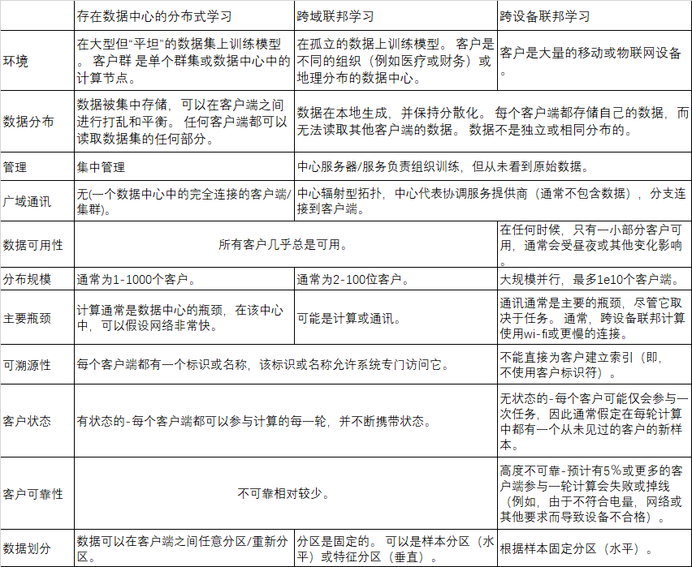
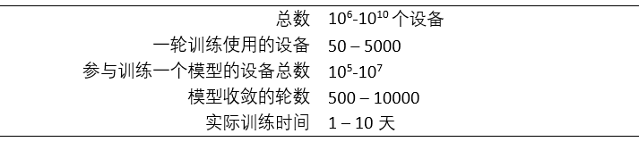

# 联邦学习的前沿和开放问题

### 1 引言

联邦学习是一类机器学习，在中心服务器（如：服务提供商）的管理下多个客户端（如：移动设备或整个组织）共同训练一个模型，同时保持训练数据去中心化。联邦学习体现了集中数据收集和最小化的原理，并且可以减轻由传统的集中式机器学习和数据科学方法导致的许多系统隐私风险和成本。受联邦学习研究爆炸性增长的推动，本文讨论了最新进展，并提出了大量未解决的问题和挑战。从研究和应用的角度看，该领域最近都引起了极大的兴趣。本文描述了联邦学习环境的定位和挑战，突出了重要的实践限制和注意事项，然后列举了一系列有价值的研究方向。这项工作的目的是突出具有重大理论和实践意义的研究问题，并鼓励对可能在现实世界中产生重大影响的问题进行研究。

“联邦学习“一词由McMahan等人在2016年提出：“我们将我们的方法称为联邦学习，因为学习任务是由中央服务器协调，通过松散联合的参与设备（我们称为客户端）来解决的”。不平衡且non-IID（非独立同分布）的数据，分布在通信带宽有限的大量不可靠设备中进行分区，这是关键性挑战。

重要的相关工作要早于联邦学习一词的引入。许多研究社区（包括密码学，数据库和机器学习）追求的长期目标是在不暴露数据的情况下分析和学习许多所有者之间分布的数据。用密码学方法计算加密数据始于1980年代初期，Agrawal、Srikant、Vaidya等人是试图使用集中式服务器从本地数据中学习同时保留隐私的早期代表。但是从引入联邦学习一词以来，我们也意识到，没有一项工作能够直接解决联邦学习的全部挑战。因此，术语“联邦学习”为在重要的隐私分散数据引发的机器学习问题中经常出现的一系列特征，约束和挑战提供了方便的简写。

联邦学习许多问题的关键特性是它们本质上是跨学科的，要解决这些问题可能不仅需要机器学习，还需要分布式优化，密码学，安全性，差分隐私，公平性，压缩感知，系统，信息论，统计等等。许多最棘手的问题都在这些领域的交汇处，因此，我们认为合作对于持续发展至关重要。这项工作的目标之一是强调可以将这些领域的技术进行潜在地组合的方式，既带来有趣的可能性，也带来新的挑战。

自从联邦学习一词最初以关注移动和边缘设备应用程序引入以来，将联邦学习应用于其他应用程序的兴趣就大大增加了，包括一些可能只涉及少量相对可靠的客户端的应用程序，例如多个组织合作培训 一个模型。我们将这两个联合学习分别称为“跨设备”和“跨库”。 鉴于这些变化，我们提出了对联合学习的更广泛定义： 

> 联邦学习是一种机器学习设置，其中多个实体（客户端）在中央服务器或服务提供商的协调下协作解决机器学习问题。每个客户的原始数据都存储在本地，不进行交换或转移； 取而代之的是，使用及时聚合的更新来实现学习目标。

重点更新是范围狭窄的更新，其中包含针对特定学习任务所需的最少信息。 在数据最小化服务中，尽可能早地执行聚合。我们注意到，此定义将联邦学习与完全去中心化（对等）学习技术区分开来，如2.1节所述。

尽管保护隐私的数据分析已经进行了50多年的研究，但仅在过去的十年中，解决方案才得到大规模部署。跨设备联合学习和联合数据分析现已应用于消费类数字产品。

对联邦学习技术的需求不断增长，导致出现了许多工具和框架。 其中包括TensorFlow Federated，Federated AI Technology Enabler，PySyft，Leaf，PaddleFL和Clara Training Framework； 附录A中有更多详细信息。既有技术公司也有小型初创公司正在开发结合联邦学习的商业数据平台。

表1将跨设备和跨域的联合学习与跨多个域的传统单数据中心分布式学习进行了对比。这些特征建立了实际的联邦学习系统通常必须满足的许多约束，因此可以激发和引出联邦学习中的公开挑战。 它们将在以下各节中详细讨论。

这两个联邦学习变型被称为具有代表性和重要性的案例，但不同的联邦学习环境可能具有这些特征的不同组合。 在本文的其余部分中，除非另有说明，我们将考虑跨设备联邦学习环境，尽管许多问题也适用于其他联邦学习环境。 第2节专门介绍了一些其他联邦学习的变型和应用。

接下来，我们将更详细地考虑跨设备联邦学习，重点关注该技术的典型大规模部署所共有的实践方面。 Bonawitz等人提供了针对特定生产系统的更多细节，包括对特定架构选择和考虑的讨论。

表1

#### 1.1 跨设备联邦学习环境

本节采用了实用的观点，并且与上一节不同，本章并不试图进行定义。相反，目标是描述跨设备联邦学习中的一些实际问题，以及它们如何适合更广泛的机器学习开发和部署生态系统。希望为随后出现的开放性问题提供有用的背景和推动，并帮助研究人员估计在现实世界的系统中部署特定的新方法将有多简单。 我们首先考虑模型的生命周期，然后再考虑联邦学习训练过程。

图1：联邦学习训练的模型以及系统中各个参与者的生命周期

##### 1.1.1 联邦学习中模型的生命周期

联邦学习过程通常由模型工程师控制，该工程师为特定应用开发模型。例如，自然语言处理领域专家可以开发用于虚拟键盘的下一单词预测模型。图1显示了主要组件和参与者。 在较高级别上，典型的工作流程是：

1. **问题辨别**：模型工程师判断问题是否要用联邦学习解决。
2. **客户端检测**：如果需要，可以对客户端（例如，在手机上运行的应用）进行检测以在本地存储（时间和数量有限制）必要的训练数据。 在许多情况下，该应用程序已经存储了此数据（例如，短信应用程序必须存储文本消息，照片管理应用程序已存储照片）。 但是，在某些情况下，可能需要维护其他数据或元数据，例如 用户交互数据，为监督学习任务提供标签。
3. **仿真原型（可选）**：模型工程师可以使用代理数据集在联邦学习仿真中对模型体系结构进行原型设计并测试学习超参数。
4. **联邦学习模型训练**：开始执行多个联邦学习训练任务以训练模型的不同变体，或使用不同的优化超参数。
5. **（联邦）模型评估**：在对任务进行了充分的训练（通常是几天，见下文）之后，将对模型进行分析并选择好的候选。 分析的内容可以包括在数据中心中的标准数据集上计算出的度量标准，也可以包括联合评估，其中将模型推送给受约束的客户端，以评估本地客户端数据。
6. **部署**：最后，一旦选择好模型，它将经历一个标准模型启动过程，包括手动质量保证、实时 A/B 测试（通常通过在某些设备上使用新模型和其他设备上的上一代模型来比较其性能），以及分阶段推出（以便在发现较差性能和影响太多用户之前回滚）。模型的特定启动过程由应用程序的所有者设置，通常与模型的训练方法无关。换句话说，此步骤将同样适用于经过联邦学习或传统数据中心方法训练的模型。

表2：典型的跨设备联合学习应用程序的数量级大小

联邦学习系统面临的主要实际挑战之一是使上述工作流程尽可能简单，理想地接近机器学习系统实现集中训练的易用性。 尽管本文中的大部分内容专门涉及联邦学习训练，但还有许多其他组件，包括联邦学习分析任务，例如模型评估和调试。优化这些问题是3.4节的重点。 现在，我们更详细地考虑单个联邦学习模型的训练（上面的步骤4）。

##### 1.1.2 典型的联邦学习训练过程

现在，我们考虑用于联邦学习训练的模板，该模板包含McMahan等人的联合平均算法，以及其他许多人的研究； 同样，这也可以进行变化，但这提供了一个共同的起点。

服务器（服务提供商）协调训练过程，通过重复以下步骤直到停止训练（由监视培训过程的模型工程师自行决定）：

1. **客户端选择**：服务器从满足资格要求的一组客户端中采样。 例如，移动电话可能仅在连接到未计费的wi-fi且处于空闲状态时才连入服务器，以避免影响设备用户。
2. **广播**：选定的客户端从服务器下载当前模型权重和训练程序（例如 TensorFlow图）。
3. **客户端计算**：每个选定的设备都通过执行训练程序在本地计算对模型的更新，例如，可以在本地数据上运行SGD（例如在联邦平均算法）。
4. **聚合**：服务器收集设备更新的聚合。 为了提高效率，一旦有足够数量的设备报告了结果，就可以放弃那些尚未提交结果的设备。 该阶段也是许多其他技术的集成点，稍后将讨论这些技术，其中可能包括：用于增加隐私的安全聚合，为了通信效率而对聚合进行有损压缩，以及针对差分隐私的噪声添加和更新限幅。
5. **模型更新**：服务器根据从参与当前轮次的客户端计算出的聚合更新，更新在服务器本地的共享模型。