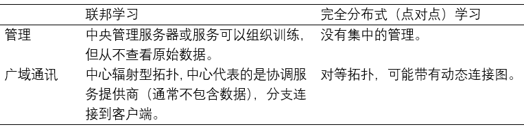
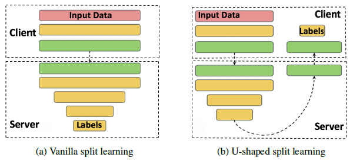
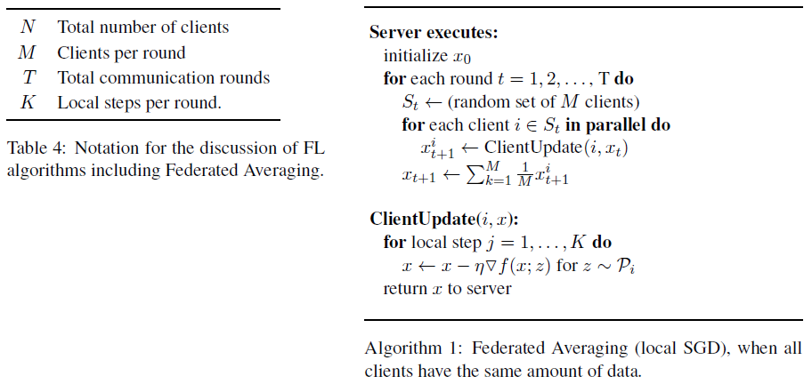
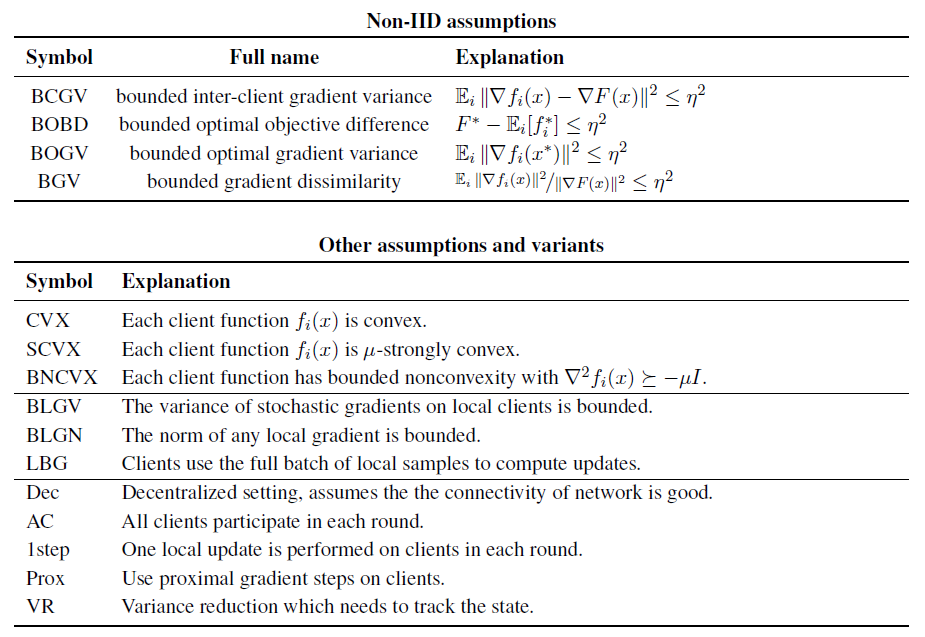
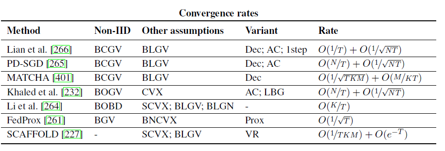
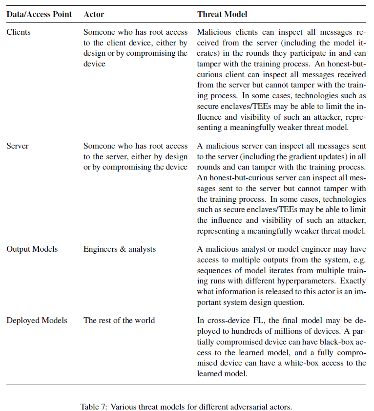

## 2 放宽核心联邦学习假设：新兴环境和方案的应用

### 2.1 完全分布式/点对点分布式学习



#### 2.1.1 算法挑战

Effect of network topology and asynchrony on decentralized SGD

Local-update decentralized SGD

Personalization, and trust mechanisms(机制)

Gradient compression and quantization(量化) methods

#### 2.1.2 实际挑战

模拟区块链

安全聚合协议	

客户端差分隐私

*(更新参数分成两部分，比较这两组的准确率，准确率低的一组随机去掉一部分节点* 
*回滚机制，如果效果不好，仍旧采取之前的参数 每次提交的时候，都附带一个准确率，准确率达到标准的的节点暂时不更新)* 

### 2.2 跨域联邦学习

现实情境：如果许多公司或组织共享激励以基于其所有数据来训练模型，但不能直接共享其数据。

数据划分(《联邦学习》主要讲的是这个跨域的部分)

```
             +--------------------+
             | Federated Learning |
             +---------+----------+
                       |
          +------------+------------+
          v                         v
+---------+------------+   +--------+-----------+
| Fully Decentralized  |   | Cross-Silo         |
| / Peer-to-Peer       |   | Federated Learning |
| Distributed Learning |   +---------+----------+
| (Cross-Devices)      |             |
+----------------------+   +---------+----------+
                           v                    v
                    +------+-------+    +-------+------+
                    | partitioning |    | partitioning |
                    | by examples  |    | by features  |
                    +--------------+    +--------------+

```

安全的多方计算或同态加密

Federated transfer learning

Federated AI Technology Enabler (FATE)

IEEE P3652.1 Federated Machine Learning Working Group

激励机制

差分隐私

Tensor factorization(采用什么样的参数，中间过程的参数，最终的参数，还是。。。)

### 2.3 拆分学习

在客户端和服务器之间按层划分模型的执行

每个客户端计算通过深层网络到达特定层（称为切入层）的前向通过。



https://splitlearning.github.io/.

## 3 提高效率和有效性

developing better optimization algorithms; providing different models to different clients; making ML tasks like hyperparameter search, architecture search, and debugging easier in the FL context; improving communication efficiency; and more.

开发更好的优化算法； 为不同的客户提供不同的模型； 在FL上下文中使诸如超参数搜索，架构搜索和调试之类的ML任务更容易； 提高沟通效率； 和更多。

### 3.1 Non-IID Data in Federated Learning

1.不相同的客户分布

- Feature distribution skew

- Label distribution skew

- Same label, different features

- Same features, different label

- Quantity skew or unbalancedness

Most empirical work on synthetic non-IID datasets (e.g. [289]) have focused on label distribution skew, where a non-IID dataset is formed by partitioning a “flat” existing dataset based on the labels.

_针对不同分布类型的数据 设计不同的处理方式_

2.Violations of independence

3.Dataset shift

#### 3.1.1 Strategies for Dealing with Non-IID Data

One natural approach is to modify existing algorithms (e.g. through different hyperparameter choices)

For some applications, it may be possible to augment data in order to make the data across clients more similar.

it is no-longer clear that treating all examples equally makes sense. Alternatives include limiting the contributions of the data from any one user (which is also important for privacy, see Section 4)

_利用联邦学习训练一个精度相对较好的模型，然后部署到设备上，本地训练生成一个高精度模型_

除了解决不相同的客户分布之外，使用多种模型还可以解决由于客户可用性变化而引起的对独立性的损害。

### 3.2 Optimization Algorithms for Federated Learning

In prototypical federated learning tasks, the goal is to learn a single global model that minimizes the empirical risk function over the entire training dataset

for optimization, non-IID and unbalanced data, limited communication bandwidth, and unreliable and limited device availability are particularly salient.

FL settings where the total number of devices is huge (e.g. across mobile devices) necessitate algorithms that only require a handful of clients to participate per round (client sampling). Further, each device is likely
to participate no more than once in the training of a given model, so stateless algorithms are necessary. This rules out the direct application of a variety of approaches that are quite effective in the datacenter context.

composability with other techniques.

combined with other techniques like cryptographic secure aggregation protocols (Section 4.2.1), differential privacy (DP) (Section 4.2.2), and model and update compression (Section 3.5).



Federated Averaging algorithm, an adaption of local-update or parallel SGD.

#### 3.2.1 Optimization Algorithms and Convergence Rates for IID Datasets

the most basic split is between assuming IID and non-IID data

H-Lipschitz 数学证明

performing more local updates saves significant communication cost and reduces the time spent per iteration

several gaps between upper and lower bounds for optimization relevant
to the federated learning setting

if any one client unpredictably slows down or fails.

asynchronous approaches may be difficult to combine with complimentary techniques like differential privacy or secure aggregation

#### 3.2.2 Optimization Algorithms and Convergence Rates for Non-IID Datasets

federated learning uses local data from end user devices, leading to many
varieties of non-IID data

FedProx algorithm





<center>Federated Learning Algorithm</center>

PD-SGD MATCHA

**Acceleration and variance reduction techniques**

**Connections to decentralized optimization**

there is still no consensus on how to incorporate momentum or variance-reduction techniques into local SGD and Federated Averaging

### 3.3 Multi-Task Learning, Personalization, and Meta-Learning

#### 3.3.1 Personalization via Featurization

#### 3.3.2 Multi-Task Learning

cross-silo与cross-device的区别：连接是否稳定

reconsider the relationship between clients (local datasets) and learning tasks (models to be trained)

#### 3.3.3 Local Fine Tuning and Meta-Learning

meta-learning

model-agnostic meta-learning    MAML algorithms

differential privacy

FL problems, modeled by existing datasets used for simulated FL experiments (Appendix A), can serve as realistic benchmark problems for MAML algorithms.

none of the existing works clearly formulates what would be comprehensive metrics for measuring personalized performance

Can non-parameter transfer LTL algorithms, such as ProtoNets, be of use for FL?

#### 3.3.4 When is a Global FL-trained Model Better?

a natural theoretical question is to determine under what conditions the shared global model is better than independent per-device models. 

Can we guarantee that the model hFL learned via federated learning is at least as accurate as hk when used for client k? Can we quantify how much improvement can be expected via federated leaning? And can we develop personalization strategies with theoretical guarantees that at least
match the performance of both natural baselines (hk and hFL)?

### 3.4 Adapting ML Workflows for Federated Learning

#### 3.4.1 Hyperparameter Tuning

Hyperparameter optimization (HPO) has a long history under the framework of AutoML, but it mainly concerns how to improve the model accuracy rather than communication and computing efficacy for mobile devices. 

#### 3.4.2 Neural Architecture Design

neural architecture search (NAS)

There are three major methods for NAS, which utilize evolutionary algorithms, reinforcement learning, or gradient descent to search for optimal architectures for a specific task on a specific dataset.

Weight Agnostic Neural Networks

#### 3.4.3 Debugging and Interpretability for FL

Augenstein et al. [32] proposed the use of differentially private
generative models (including GANs), trained with federated learning.

whether any of these methods or their combinations can come close to providing optimal trade-offs between communication and accuracy in federated learning.

it is difficult to deduce concrete insights from these theoretical works for communication bandwidth reduction in practice as they typically ignore the impact of the optimization algorithm.

### 3.5 Communication and Compression

**Compression objectives**

- Gradient compression – reduce the size of the object communicated from clients to server, which is used to update the global model.
- Model broadcast compression – reduce the size of the model broadcast from server to clients, from which the clients start local training.
- Local computation reduction – any modification to the overall training algorithm such that the local training procedure is computationally more efficient.

broader ML community

*facebook 开放了一个差分隐私库*

**Compatibility with differential privacy and secure aggregation**

Secure Aggregation and mechanisms of adding noise to achieve differential privacy

*模仿网络层来设计联邦学习*

Joint design of compression methods that are compatible with Secure Aggregation, or for which differential privacy guarantees can be obtained, is thus a valuable open problem.

**Wireless-FL co-design**

Potential
solutions to address this challenge include federated distillation (FD), in which workers exchange their model output parameters (logits) as opposed to the model parameters (gradients and/weights), and optimizing workers’ scheduling policy with appropriate communication and computing resources.

### 3.6 Application To More Types of Machine Learning Problems and Models

Bayesian neural networks

## 4 Preserving the Privacy of User Data

we advocate a strategy wherein the overall system is composed of modular units which can be studied and improved relatively independently, while also reminding ourselves that we must, in the end, measure the privacy properties of the complete system against our ideal privacy goals set out above.

### 4.1 Actors, Threat Models, and Privacy in Depth

Secure Multi-Party Computation (MPC) protocol

Trusted Execution Environment (TEE)

Private Disclosure techniques

### 4.2 Tools and Technologies

First, we need to consider how f is computed and what is the information flow of intermediate results in the process, which primarily influences the susceptibility to malicious client, server, and admin actors.



Second, we have to consider what is computed.

Finally, there is the problem of verifiability, which pertains to the ability of a client or the server to prove to others in the system that they have executed the desired behavior faithfully, without revealing the potentially private data upon which they were acting.

remote attestation and zero-knowledge proofs

#### 4.2.1 Secure Computations

**Secure multi-party computation**

*Homomorphic encryption*

*同态加密使用格密码 椭圆曲线方案*

**Trusted execution environments**


**Trusted execution environments**

**Secure computation problems of interest**

*Secure aggregation*

*Secure shuffling*

*Private information retrieval*

Recent results on PIR have shown dramatic reductions in the computational cost through the use of lattice-based cryptosystems

#### 4.2.2 Privacy-Preserving Disclosures

**Local differential privacy**

Thus, there is a need for a model of differential privacy that interpolates between purely central and purely local DP. This can be achieved through distributed differential privacy, or the hybrid model, as discussed below.

**Distributed differential privacy**

*Distributed DP via secure aggregation*

*Distributed DP via secure shuffling*

Encode-Shuffle-Analyze (ESA) framework	Prochlo system

**Hybrid differential privacy**

This construction can be directly applied in the federated learning setting

#### 4.2.3 Verifiability

Multiple techniques can be useful to provide verifiability: zero-knowledge proofs (ZKPs), trusted execution environments (TEEs), or remote attestation.

**Zero-knowledge proofs (ZKPs)**

Succinct non-interactive zero-knowledge proofs	libsnark	Libra

Using interactive ZKP systems and NIZKs efficiently in the context of FL remains a challenging open question.

In the setting where the verifier is the client, it
will be challenging to create a trustworthy statement to verify as it involves input from other clients.

In the setting where the verifier is the client, it will be challenging to create a trustworthy statement to verify as it involves input from other clients. Of
interest in this setting, recent work enables to handle the case where the multiple verifiers have shares of the statement

**Trusted execution environment and remote attestation**

### 4.3 Protections Against External Malicious Actors

#### 4.3.1 Auditing the Iterates and Final Model

worst-case upper-bound

An interesting emerging area of research in this space examines the theoretic conditions (on the audited model and attacks) under which an unsuccessful attempt to identify privacy violations by a simulated attack implies that no stronger attacks can succeed at such a task.

it may be possible to design new tractable methods for quantifying a model’s average-case or worst-case attack susceptibility.

#### 4.3.2 Training with Central Differential Privacy

the server clips the L2 norm of individual updates, aggregates the clipped updates, and then adds Gaussian noise to the aggregate.

To track the overall privacy budget across rounds, advanced composition theorems [148, 221] or the analytical moments accountant method developed in [7, 297, 299, 405] can be used.

The moments accountant method works particularly well with the uniformly subsampled Gaussian mechanism.

figuring out how to adaptively bound the contributions of users and clip the model parameters remains an interesting research direction.

**Privacy amplification for non-uniform device sampling procedures**

quantifying the privacy amplification gains in cross-device FL is an interesting open problem.

**Sources of randomness**

**Auditing differential privacy implementations**

#### 4.3.3 Concealing the Iterates

the MPC model

#### 4.3.4 Repeated Analyses over Evolving Data

Specific open questions include:	P51

#### 4.3.5 Preventing Model Theft and Misuse

Protecting a deployed model during inference is closely related to the challenge of concealing the model iterates from clients during training

### 4.4 Protections Against an Adversarial Server

#### 4.4.1 Challenges: Communication Channels, Sybil Attacks, and Selection

In the cross-device FL setting, we have a server with significant computational resources and a large number of clients that (i) can only communicate with the server (as in a star network topology), and (ii) may be
limited in connectivity and bandwidth.

An actively malicious adversary controlling the server could simulate a large number of fake client devices (a “Sybil attack” [140]) or could preferentially select previously compromised devices from the pool of available devices.

#### 4.4.2 Limitations of Existing Solutions

This involves formally defining (a) what is the view of the clients data revealed to the server as a result of an FL execution, and (b) what is the privacy leakage of such a view.

outline some of the weaknesses of these methods

**Local differential privacy**

LDP assumes that a user’s privacy comes solely from that user’s addition of their own randomness; thus, a user’s privacy guarantee is independent of the additional randomness incorporated by all other users.

Part of this difficulty is attributed to the fact that the magnitude of the random noise introduced must be comparable to the magnitude of the signal in the data, which may require combining reports between clients.

Therefore, obtaining utility with LDP comparable to that in the central setting thus requires a relatively larger user-base or larger choice of " parameter.

**Hybrid differential privacy**

it does not provide privacy amplification of users’ locally-added noise.

it is unclear which application areas and algorithms can best utilize hybrid trust model data

Current work on the hybrid model typically assumes that regardless of the user trust preference, their data comes from the same distribution

**The shuffle model**

The first is the requirement of a trusted intermediary首先是可信中介的要求

The second drawback is that the shuffle model’s differential privacy guarantee degrades in proportion to the number of adversarial users participating in the computation

**Secure aggregation**

this approach has several limitations: (a) it assumes a semi-honest server (only in the private key infrastructure phase), (b) it allows the server to see the per-round aggregates (which may still leak information), (c) it is not efficient for sparse vector aggregation, and (d) it lacks the ability to enforce well-formedness of client inputs.

#### 4.4.3 Training with Distributed Differential Privacy

**Communication, privacy, and accuracy trade-offs under distributed DP**

*Trade-offs for secure shuffling*

Two notable open questions are (i) to study pure differential privacy in the shuffled model, and (ii) to determine the optimal privacy, accuracy and communication trade-off for variable selection in the multimessage setup

*Trade-offs for secure aggregation*


**Privacy accounting**

**Handling client dropouts**

More generally, the problem of operating at scale when clients are likely to be intermittently available has not been systematically addressed yet in the literature.

**New trust models**

Can this be leveraged to enact a trust model where the server’s behavior is trusted-but-verified, i.e. wherein the server is not prevented from deviating from the desired protocol, but is extremely likely to be detected if it does (thereby damaging the trust, reputation, and potentially financial or legal status of the hosting organization)?

#### 4.4.4 Preserving Privacy While Training Sub-Models

Open problems in this area include characterizing the sparsity regimes associated with sub-model training problems of practical interest and developing of sparse secure aggregation techniques that are communication efficient in these sparsity regimes.

Some forms of local and distributed differential privacy also pose challenges here, in that noise is often added to all elements of the vector, even those that are zero

### 4.5 User Perception

While the previous sections focused on rigorous quantification of privacy
against precise threat models, this section focuses on challenges around the users’ perception and needs.

#### 4.5.1 Understanding Privacy Needs for Particular Analysis Tasks

This approach is formalized in the Pufferfish framework of privacy [235], which allows the analyst to  specify a class of protected predicates that must be learned subject to the guarantees of differential privacy, and all other predicates can be learned without differential privacy.

#### 4.5.2 Behavioral Research to Elicit Privacy Preferences

educational component and preference measurement

## 5 Robustness to Attacks and Failures

### 5.1 Adversarial Attacks on Model Performance

Examples of adversarial attacks include data poisoning, model update poisoning, and model evasion attacks

These attacks can be broadly classified into training-time attacks (poisoning
attacks) and inference-time attacks (evasion attacks).

we will discuss inference-time attacks below because (a) attacks on the training phase can be used as a stepping stone towards inference-time attacks, and (b) many defenses against inference-time attacks are implemented during training.

#### 5.1.1 Goals and Capabilities of an Adversary

**Goals**

1. untargeted attacks, or model downgrade attacks, which aim to reduce the model’s global accuracy, or “fully break” the global model
2. targeted attacks, or backdoor attacks, which aim to alter the model’s behavior on a minority of examples while maintaining good overall accuracy on all other examples

**Capabilities**


model update poisoning

data poisoning

evasion attacks

The federated setting shares a training-time poisoning attack vector with datacenter multi-machine learning: the model update sent from remote workers back to the shared model.

This is potentially a powerful capability, as adversaries can construct malicious updates that achieve the exact desired effect, ignoring the prescribed client loss function or training scheme.

While a malicious aggregator could potentially be detected by methods that prove the  integrity of the training process (such as multi-party computations or zero-knowledge proofs),

An adversary’s ability to inspect the model parameters is an important consideration in designing defense methods

An important axis to evaluate in the context of specific federated settings (cross-device, cross-silo, etc.) is the capability of participant collusion.

Perhaps worse for our poor federated learning defenses researcher, collusion may not be happening in “real time” (within-update collusion), but rather across model updates (cross-update collusion).

limited participation rate

Thus, an adversary limited to a single client may only be able to inject a poisoned update a limited number of times.

In contrast, a malicious user with the ability to continuously participate in the federated setting could launch a poisoning attack throughout model training, where the user adaptively modifies training data or model updates as the training progresses.

#### 5.1.2 Model Update Poisoning

In federated settings, this could be performed by corrupting the updates of a client directly, or some kind of man-in-the-middle attack.

we assume that the adversary (or adversaries) directly control some number of clients, and that they can directly alter the outputs of these clients to try to bias the learned model towards their objective.

**Untargeted and Byzantine attacks**

**Byzantine-resilient defenses**

Another line of model update poisoning defenses use redundancy and data shuffling to mitigate Byzantine attacks

**Targeted model update attacks**

since the adversary’s aim is to only affect the classification outcome on a small number of data points, while maintaining the overall accuracy of the centrally learned model, defenses for untargeted attacks often fail to
address targeted attacks

An interesting avenue for future work would be to explore the use of zero-knowledge proofs to ensure that users are submitting updates with pre-specified properties. Solutions based on hardware attestation could also be
considered.

**Collusion defenses**

Potential challenges for federated learning involve defending against collusion or detecting colluding adversaries, without directly inspecting the data of nodes.

#### 5.1.3 Data Poisoning Attacks

the adversary can only manipulate client data, perhaps by replacing labels or specific features of the data.

This attack model may be more natural when the adversary can only influence the data collection process at the edge of the federated learning system, but cannot directly corrupt derived quantities within the learning system

**Data poisoning and Byzantine-robust aggregation**

Since data poisoning attacks induce model update poisoning, any defense against Byzantine updates can also be used to defend against data poisoning.

**Data sanitization and network pruning**

**Relationship between model update poisoning and data poisoning**

One interesting line of study would be to quantify the gap between these two types of attacks, and relate this gap to the relative strength of an adversary operating under these attack models

This problem can be tackled in a variety of manners. Empirically, one could study the discrepancy in performance of various attacks. or investigate whether various model update poisoning attacks can be approximated by data poisoning attacks, and would develop methods for doing so.

#### 5.1.4 Inference-Time Evasion Attacks

adversarial training was developed primarily for IID data, and it is unclear how it performs in non-IID settings.

**Relationship between training-time and inference-time attacks**

#### 5.1.5 Defensive Capabilities from Privacy Guarantees

**Defending against model update poisoning attacks**

differential privacy can be viewed as both a strong and a weak defense against data poisoning—it is strong in that it is extremely general and provides worst case protection no matter the goals of the adversary, and it is weak in that the adversary must be restricted and noise must be added to the federated learning process.

**Defending against inference-time evasion attacks**

### 5.2 Non-Malicious Failure Modes

**Client reporting failures**

**Data pipeline failures**

**Noisy model updates**

### 5.3 Exploring the Tension between Privacy and Robustness

While useful for ensuring privacy, SecAgg generally makes defenses against adversarial attacks more difficult to implement, as the central server only sees the aggregate of the client updates.

## 6 Ensuring Fairness and Addressing Sources of Bias

### 6.1 Bias in Training Data 

通过GAN生成多种类型的数据，平衡bias

### 6.2 Fairness Without Access to Sensitive Attributes

### 6.3 Fairness, Privacy, and Robustness

In some ways, however, the ideal of fairness seems to be in tension with the notions of privacy for which FL seeks to provide guarantees.

### 6.4 Leveraging Federation to Improve Model Diversity

### 6.5 Federated Fairness: New Opportunities and Challenges

agnostic federated learning

*公平 隐私保护 攻击*

## 7 Concluding Remarks


