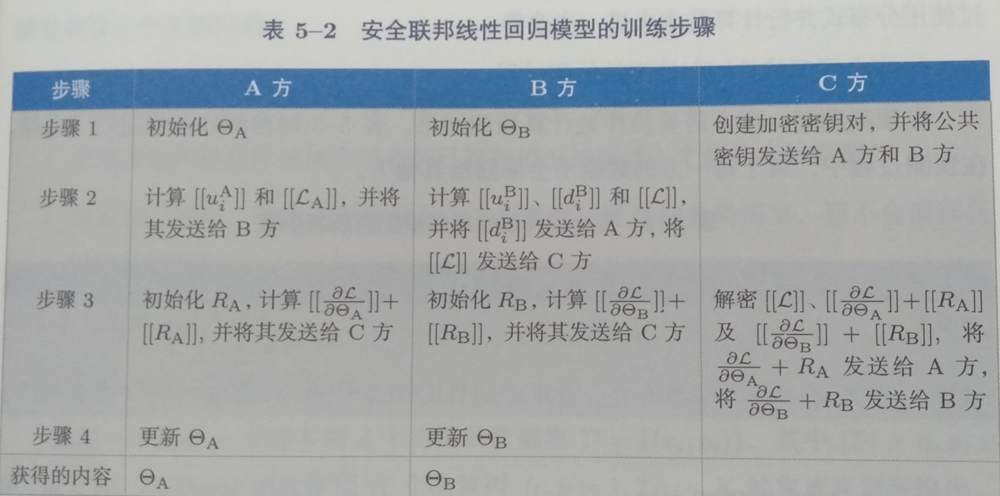

# 联邦学习

## 1 引言

### 1.1 联邦学习的定义

联邦学习旨在建立一个基于分布数据集的联邦学习模型。联邦学习包括两个过程，分别是模型训练和模型推理。在模型训练的过程中，模型相关的信息能够在各方之间交换（或者是以加密形式进行交换），但数据不能。这一交换不会暴露每个站点上数据的任何受保护的隐私部分。已训练好的联邦学习模型可以置于联邦学习系统的各参与方，也可以在多方之间共享。

具体来讲，联邦学习是一种具有以下特征的用来建立机器学习模型的算法框架。其中，机器学习模型是指将某一方的数据实例映射到预测结果输出的函数。

* 有两个或以上的联邦学习参与方协作构建一个共享的机器学习模型。每一个参与方都拥有若干能够用来训练模型的训练数据。

* 在联邦学习模型的训练过程中，每一个参与方拥有的数据都不会离开该参与方，即数据不离开数据拥有者。 
* 联邦学习模型相关的信息能够以加密方式在各方之间进行传输和交换，并且需要保证任何一个参与方都不能推测出其他方的原始数据。
* 联邦学习模型的性能要能够充分逼近理想模型（是指通过将所有训练数据集在一起并训练获得的机器学习模型）的性能。

### 1.2 联邦学习的分类

#### 1.2.1 横向联邦学习

在两个数据集的用户特征重叠较多而用户重叠较少的情况下，我们把数据集按照横向 (即用户维度)切分，并取出双方用户特征相同而用户不完全相同的那部分数据进行训练。这 种方法叫做横向联邦学习。比如有两家不同地区银行，它们的用户群体分别来自各自所在的地区，相互的交集很小。但是，它们的业务很相似，因此，记录的用户特征是相同的。此时， 就可以使用横向联邦学习来构建联合模型。Google 在 2017 年提出了一个针对安卓手机模型 更新的数据联合建模方案：在单个用户使用安卓手机时，不断在本地更新模型参数并将参数上传到安卓云上，从而使特征维度相同的各数据拥有方建立联合模型的一种联邦学习方案。

#### 1.2.2 纵向联邦学习

在两个数据集的用户重叠较多而用户特征重叠较少的情况下，我们把数据集按照纵向 （即特征维度）切分，并取出双方用户相同而用户特征不完全相同的那部分数据进行训练。 这种方法叫做纵向联邦学习。比如有两个不同机构，一家是某地的银行，另一家是同一个地方的电商。它们的用户群体很有可能包含该地的大部分居民，因此用户的交集较大。但是，由于银行记录的都是用户的收支行为与信用评级，而电商则保有用户的浏览与购买历史，因此它们的用户特征交集较小。纵向联邦学习就是将这些不同特征在加密的状态下加以聚合，以增强模型能力的联邦学习。目前，逻辑回归模型，树型结构模型和神经网络模型等众多机器学习模型已经逐渐被证实能够建立在这个联邦体系上。

#### 1.2.3 联邦迁移学习

在两个数据集的用户与用户特征重叠都较少的情况下，我们不对数据进行切分，而可以 利用迁移学习来克服数据或标签不足的情况。这种方法叫做联邦迁移学习。 比如有两个不同机构，一家是位于中国的银行，另一家是位于美国的电商。由于受到地域限制，这两家机构的用户群体交集很小。同时，由于机构类型的不同，二者的数据特征也只有小部分重合。在这种情况下，要想进行有效的联邦学习，就必须引入迁移学习， 来解决单边数据规模小和标签样本少的问题，从而提升模型的效果。

## 2 隐私、安全及机器学习

### 2.1 面向隐私保护的机器学习(PPML)与安全机器学习

#### 2.1.1 重构攻击

敌手的目标是在模型的训练期间抽取训练数据，或抽取训练数据的特征向量。

#### 2.1.2 模型反演攻击

敌手被假设为对模型拥有白盒访问权限或黑盒访问权限。对于白盒访问，敌手不需要存储特征向量便能获取模型的明文内容。对于黑盒访问，敌手只能查询模型的数据和收集返回结果。敌手的目的是从模型中抽取训练数据或训练数据的特征向量。拥有黑盒权限的敌手也可能会通过实施方程求解攻击，从回应中重构模型的明文内容。

#### 2.1.3 成员推理攻击

敌手对模型至少有黑盒访问权限，同时拥有-个特定的样本作为其先验知识。敌手的目标是判断模型的训练集中是否包含特定的样本。敌手通过机器学习模型的输出试图推断此样本是否属于模型的训练集。敌手的目标是获知给定样本是否在模型的训练集中。敌手被假设为对模型拥有白盒访问权限或黑盒访问权限和一个样本。敌手将基于机器学习模型的输出来推理一个样本数据是否隶属于该模型的训练集。

#### 2.1.4 特征推理攻击

敌手出于恶意目的，将数据去匿名化或锁定记录的拥有者。

### 2.2 隐私保护技术

#### 2.2.1 安全多方计算

不经意传输 秘密共享 阈值同态

#### 2.2.2 同态加密

#### 2.2.3 差分隐私

## 3 分布式机器学习

本章简要介绍了DML，包括面向扩展性的DML和面向隐私保护的DML。面向扩展性的DML被广泛用于解决大规模机器学习问题中的计算资源和内存空间限制。 并行技术( 例如数据并行、模型并行和混合并行)是实现面向扩展性的DML系统的主要选择。出于隐私保护考虑，面向隐私保护的DML主要用于保护用户隐私，并通过分散的数据存储来确保数据安全。安全多方计算、同态加密和差分隐私是面向隐私 保护的DML系统里的常用隐私保护技术。在本章里，我们还看到面向隐私保护的梯 度下降方法也已被广泛用于面向隐私保护的DML系统中。

## 4 横向联邦学习

横向联邦学习也称为按样本划分的联邦学习( Sample- Partitioned Federated Learning或Example- Partitioned Federated Learning)， 可以应用于联邦学习的各个参与方的数据集有相同的特征空间和不同的样本空间的场景。

### 4.1 横向联邦学习架构

#### 4.1.1 客户-服务器架构

- 各参与方在本地计算模型梯度，并使用同态加密、 差分隐私或秘密共享等加密技术，对梯度信息进行掩饰，并将掩饰后的结果(简称为加密梯度)发送给聚合服务器。
- 服务器进行安全聚合( secure aggregation) 操作，如使用基于同态加密的加权平均。
- 服务器将聚合后的结果发送给各参与方。 
- 各参与方对收到的梯度进行解密，并使用解密后的梯度结果更新各自的模型参数。

#### 4.1.2 对等网络架构

1. 循环传输
2. 随机传输

### 4.2 联邦平均算法

#### 4.2.1 联邦优化

- 数据集的非独立同分布
- 不平衡的数据量
- 数量很大的参与方
- 慢速且不稳定的通信连接

#### 4.2.2 联邦平均算法

#### 4.2.3 安全的联邦平均算法

### 4.3 联邦平均算法的改进

#### 4.3.1 通信效率提升

- 压缩的模型参数更新
- 结构化的模型参数更新

#### 4.3.2 参与方选择

## 5 纵向联邦学习

我们把在数据集上具有相同的样本空间、不同的特征空间的参与方所组成的联邦学习归类为纵向联邦学习，也可以理解为按特征划分的联邦学习。

- 加密实体对齐
- 加密模型训练
  - 协调者C创建密钥对，并将公共密钥发送给A 和B方。
  - A方和B方对中间结果进行加密和交换。中间结果用来帮助计算梯度和损失值。
  - A方和B方计算加密梯度并分别加入附加掩码(additional mask)。B方还会计算加密损失。A方和B方将加密的结果发送给C方。
  - C方对梯度和损失信息进行解密，并将结果发送回A方和B方。A方 和B方解除梯度信息上的掩码，并根据这些梯度信息来更新模型参数。

### 5.1 纵向联邦学习算法

#### 5.1.1 安全联邦线性回归

#### 5.1.2 安全联邦提升树

## ‌6 联邦迁移学习

横向联邦学习和纵向联邦学习要求所有的参与方具有相同的特征空间或样本空 间，从而建立起一-个有效的共享机器学习模型。然而，在更多的实际情况下，各个参与方所拥有的数据集可能存在高度的差异:

- 参与方的数据集之间可能只有少量的重叠样本和特征。
- 这些数据集的分布情况可能差别很大。
- 这些数据集的规模可能差异巨大。
- 某些参与方可能只有数据，没有或只有很少的标注数据。

为了解决这些问题，联邦学习可以结合迁移学习技术，使其可以应用于更广的业务范围.同时可以帮助只有少量数据(较少重叠的样本和特征)和弱监督(较少标记)的应用建立有效且精确的机器学习模型，并且遵守数据隐私和安全条例的规定。

- 基于实例的联邦迁移学习
- 基于特征的联邦迁移学习
- 基于模型的联邦迁移学习

### 6.1 联邦迁移学习框架

‌

## 7 联邦学习激励机制

### 7.1 收益分享博弈

1. 平等
2. 边际收益
3. 边际损失

### 7.2 策略协调

1. 贡献公平性
2. 期望损失分配公平性
3. 期望公平性

